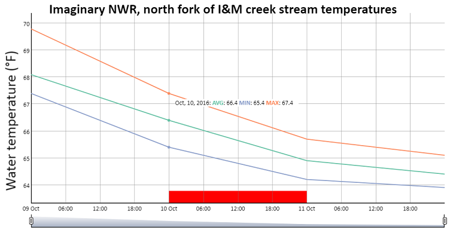

[](https://travis-ci.org/adamdsmith/r4streams)

USFWS Disclaimer
================

This United States Fish & Wildlife Service (USFWS) code is provided on an "as is" basis and the user assumes responsibility for its use. USFWS has relinquished control of the information and no longer has responsibility to protect the integrity , confidentiality, or availability of the information. Any reference to specific commercial products, processes, or services by service mark, trademark, manufacturer, or otherwise, does not constitute or imply their endorsement, recomendation or favoring by USFWS. The USFWS seal and logo shall not be used in any manner to imply endorsement of any commercial product or activity by USFWS or the United States Government.

Installing `r4streams`
======================

The `r4streams` package requires you to have [R](https://www.r-project.org/) (&gt;= 3.3) installed on your computer as well as [Rtools](https://cran.r-project.org/bin/windows/Rtools/). Both will require administrative priveleges but the installation of packages after this initial install will not.

With R and Rtools installed, it's simple to install and load the `r4streams` package to access its functionality. If you receive an SSL or CA Certificate error, you may need to take the extra step documented below.

    # If devtools package is not installed
    install.packages("devtools", dependencies = TRUE)

    # Now install and load r4streams
    devtools::install_github("adamdsmith/r4streams")
    library("r4streams")

    # If you receive a SSL or CA Certificate error
    install.packages("httr")
    library("httr")
    set_config(config(ssl_verifypeer = 0L))
    devtools::install_github("adamdsmith/r4streams")
    library("r4streams")

The `r4streams` package
=======================

This packages currently contains functions to:

1.  process `csv` files generated by HOBOware Pro software for data retrieved from HOBO water temperature loggers; and
2.  visualize the resulting time series of stream temperatures.

Using `r4streams`
=================

Currently, the primary functionality of the package rests in two functions: `read_hobo_csv` and the corresponding `plot` method for the output of that function.

`read_hobo_csv` accepts as input the `csv` file created by HOBOware Pro and generates a tidy data frame of logger serial number, observation date and time information, and obsvered temperature. Other information (e.g., logger events) are discarded.

The user can either pass the pathname to the `csv` file to process, if it is known, or use the function without any arguments to browse to the `csv`.

``` r
# If the path is known, you can specify it directly
test <- read_hobo_csv("C:/Program Files/R/R-3.4.0/library/r4streams/extdata/test.csv")

# If you'd rather browse to the file, use without arguments
test <- read_hobo_csv()
```

The resulting object (`test`, in this case) is a custom `hobo` class object (and a `data.frame`) with an associated `plot` method that produces an interactive dygraph of daily average, minimum, and maximum stream temperatures using the [dygraphs JavaScript library](http://dygraphs.com/). Several arguments to the `plot` function provide some flexibility:

-   `x`: the `hobo` object created by `read_hobo_csv`
-   `stn`: a **required** string indicating a descriptive name for the data logger location used in the plot title and, if the plot is saved, the filename
-   `flag`: a threshold number of observations *below which* daily average temperatures are flagged to indicate a potentially inadequate number of observations. Default (36) flags daily values based on less than 75% of the expected daily observations (i.e., 48 30-min observations). Flagged days are indicated by a red bar along the x-axis (see figure below).
-   `save`: option to save interactive plot as a standalone `html` file (use `save = TRUE`)
-   `out_dir`: if saving to `html`, option to specify the output directory for the `html` file. By default, it saves it in the current working directory (which you can find by running `getwd()`)
-   `verbose`: option to turn off messages about where `html` file was saved, if requested (use `verbose = FALSE` to turn off).

The figure below is static, but illustrates the primary functionality of the plot: interactive display of daily average, minimum, and maximum temperature and a red bar along the x-axis indicating if a day failed to meet the data requirements as specified by the user in the `flag` argument.

``` r
plot(test, stn = "Imaginary NWR, north fork of I&M creek")
```


